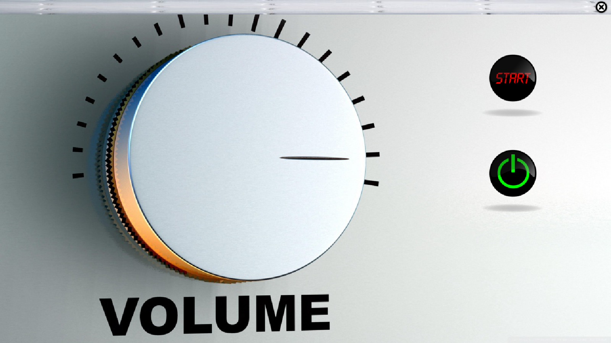
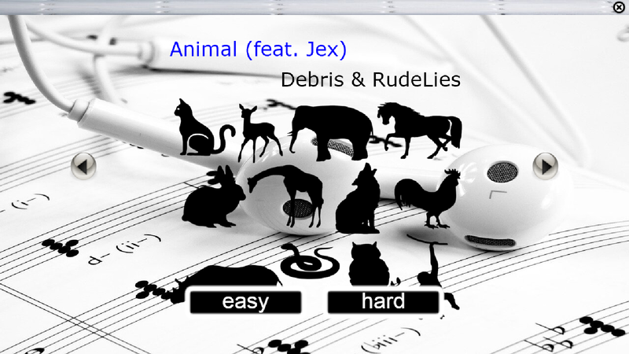
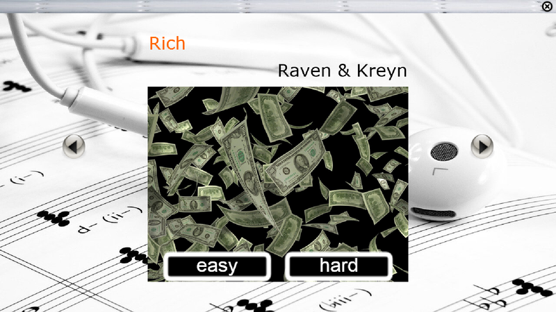
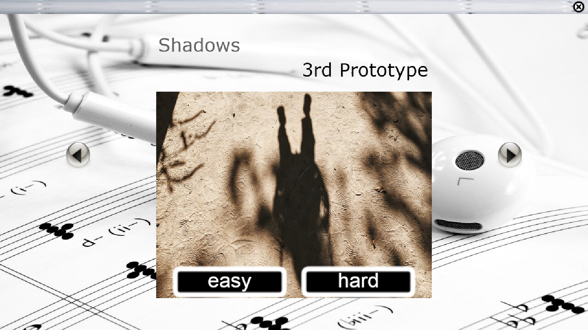
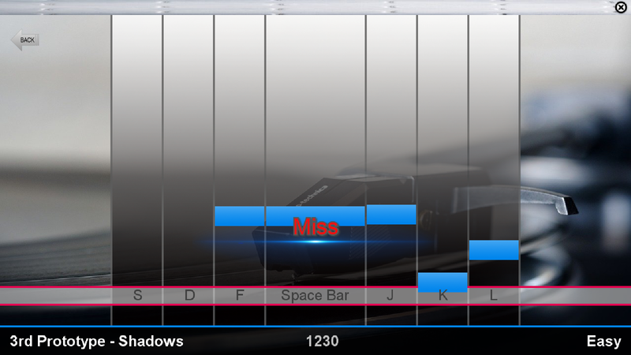
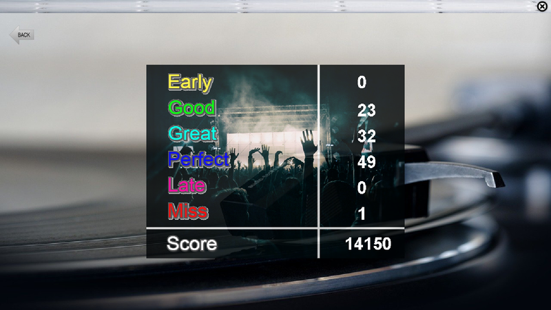

# Rhythm-Game

## 게임 조작
> ### ● 게임 시작 화면  
>   
> start 버튼을 누르면 음악 선택 화면으로 이동합니다.  
> 종료 버튼을 누르면 게임이 종료됩니다.  
> 게임 창 우측 상단에 있는 x 버튼을 눌러도 게임이 종료됩니다.
  
> ### ● 음악 선택 화면
>   
>   
>   
> 그림 양쪽에 있는 화살표를 누르면 다른 음악을 선택할 수 있습니다.  
> 그림 하단에 있는 easy 버튼과 hard 버튼은 게임 난이도입니다.  
> hard가 easy보다 어렵고 점수도 더 높게 매겨집니다.  
> 그림 하단에 있는 easy 버튼 혹은 hard 버튼을 누르면 게임 실행 화면으로 넘어갑니다.  
  
> ### ● 게임 실행 화면
>   
> 그림 맨 밑에는 현재 음악과 점수 그리고 난이도가 표시됩니다.  
> 그림 하단에 가로로 길게 뻗어져있는 선은 판정 라인입니다.  
> 게임이 시작되면 음악에 맞춰 막대들이 내려오는데 막대가 판정 라인에 올 때 해당 키를 누르면 됩니다.  
> 판정에따라 점수가 다르게 측정됩니다.  
> 게임 창 왼쪽 상단에 있는 Back 버튼을 누르면 게임이 종료되고 음악 선택 화면으로 이동합니다.  
>  
> 해당 키를 많이 일찍 누르면 **Early**  
> 해당 키를 일찍 누르거나 늦게 누르면 **Good**  
> 해당 키를 조금 일찍 누르거나 조금 늦게 누르면 **Great**  
> 해당 키를 정확히 누르면 **Perfect**  
> 해당 키를 많이 늦게 누르면 **Late**  
> 해당 키를 안 누르면 **Miss**가 화면에 표시됩니다.  
>  
> 점수  
> **Miss < Early = Late < Good < Great < Perfect**
  
> ### ● 점수 화면
>   
> 게임이 끝나면 게임 결과가 표시됩니다.  
> **Early, Good, Great, Perfect, Late, Miss**의 오른편 숫자는 각각의 횟수입니다.  
> **Score**의 오른편 숫자는 최종 점수입니다.  
> 게임 창 왼쪽 상단에 있는 Back 버튼을 누르면 음악 선택 화면으로 이동합니다.  

## 주의사항
> ### ● 음악 선택 후 게임이 시작했는데 키를 눌러도 반응이 없을 경우  
> -> Back 버튼을 눌러서 게임에서 나온 뒤 다른 음악을 선택했다가 돌아오시면 됩니다.
>  
> ### ● 게임 종료 후 새로 게임을 하려는데 게임 결과 화면이 표시될 경우  
> -> Back 버튼을 눌러서 게임에서 나온 뒤 다시 실행하시면 됩니다.
